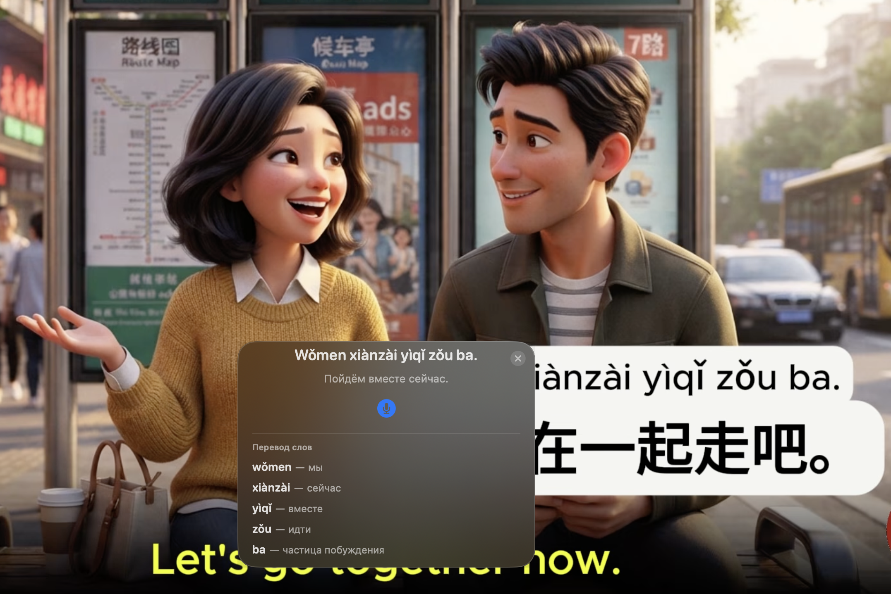
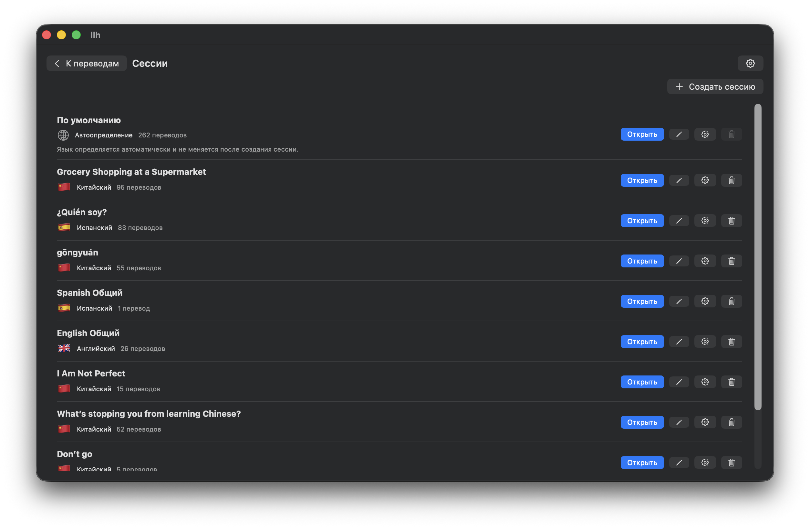
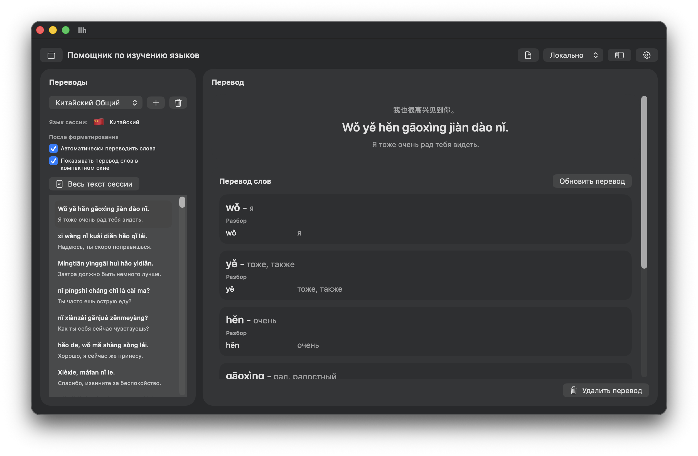

# LLH — помощник для изучения языков

<p align="center">
  
</p>

<p align="center">
  macOS-приложение, которое помогает переводить текст с экрана, разбирать слова и сохранять материалы по отдельным языковым сессиям.
</p>

<p align="center">
  
  
  
  
</p>

## Что умеет

- **Захватывать область экрана** по горячей клавише и распознавать текст через локальный OCR или AI OCR.
- **Переводить и форматировать текст** с помощью OpenAI или DeepSeek.
- **Показывать результат поверх других приложений**: перевод, разбор слов и голосовой вопрос доступны в компактном окне.
- **Хранить переводы в сессиях** — например, отдельная сессия для китайского, английского или испанского.
- **Разбирать слова**: перевод, транскрипция и дополнительные учебные материалы для выбранного текста.
- **Работать с голосом**: записывать вопрос с микрофона и отправлять его в чат по текущему переводу.
- **Настраивать горячие клавиши**, время показа компактного окна, OCR и выбранную AI-модель.
- **Хранить ключи безопасно** в macOS Keychain, а историю — локально в SQLite.

> Поддерживаемые языковые сессии: английский, испанский и китайский. Также есть режим автоопределения языка без разбора слов.

## Интерфейс

### История и сессии

Создавайте отдельные сессии для языков и тем, открывайте историю переводов, переименовывайте и настраивайте автоматическую загрузку разбора слов.

<p align="center">
  
</p>

### Перевод и разбор слов

В рабочем окне слева находится история переводов, а справа — выбранный текст, его перевод и карточки с разбором слов.

<p align="center">
  
</p>

### Компактное окно

При запуске захвата горячей клавишей LLH может вывести перевод поверх видео, браузера или другого приложения. При необходимости в нём же виден разбор слов, а кнопка микрофона позволяет задать вопрос голосом.

## Как это работает

1. Создайте языковую сессию.
2. Настройте API-ключ и модель в разделе **«ИИ»**.
3. Назначьте горячую клавишу для захвата области экрана.
4. Выделите текст на экране — LLH распознает его, отформатирует, переведёт и сохранит результат в истории.
5. Откройте перевод в приложении или посмотрите его в компактном окне.

## Требования

- macOS 26 или новее;
- Xcode с поддержкой SwiftUI для macOS 26;
- разрешение **Screen Recording** для захвата текста с экрана;
- API-ключ OpenAI для AI OCR и голосовых запросов;
- API-ключ OpenAI или DeepSeek для перевода, форматирования и разбора слов.

## Запуск

```bash
git clone git@github.com:niiikkid/llh.git
cd llh
open llh.xcodeproj
```

1. В Xcode выберите схему **llh** и запустите приложение.
2. При первом захвате текста разрешите Screen Recording в системных настройках macOS.
3. Откройте настройки приложения → **«ИИ»**, добавьте ключи и выберите модели.

Зависимости подключаются через Swift Package Manager:

- [KeyboardShortcuts](https://github.com/sindresorhus/KeyboardShortcuts) — глобальные горячие клавиши;
- [GRDB.swift](https://github.com/groue/GRDB.swift) — локальное хранилище SQLite.

## Приватность

- История переводов хранится локально на компьютере.
- Ключи API сохраняются в macOS Keychain.
- Снимки экрана отправляются только при использовании **AI OCR**, который работает через OpenAI.
- DeepSeek используется для текста: перевода, форматирования и учебных материалов; изображения ему не отправляются.

## Стек

- Swift / SwiftUI
- AppKit и ScreenCaptureKit
- Vision OCR
- AVFoundation
- SQLite + GRDB
- OpenAI API и DeepSeek API

## Лицензия

В репозитории пока нет файла лицензии. Перед использованием или распространением проекта уточните условия у автора.
